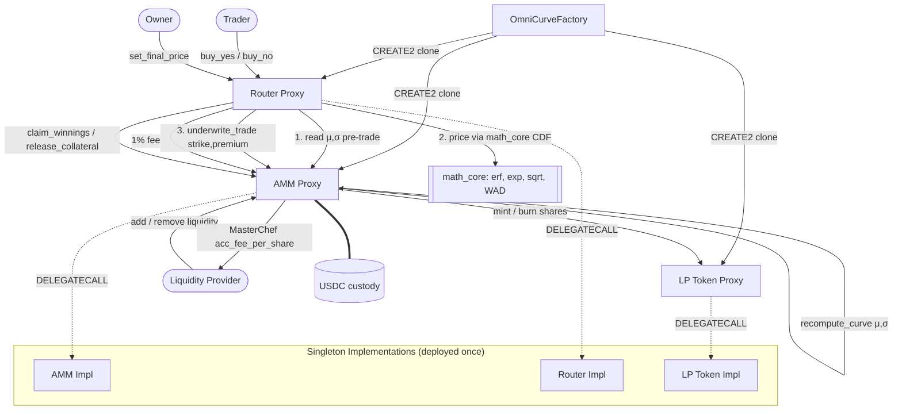

<div align="center">

# OmniCurve — Whitepaper

### A Unified Continuous-Distribution Prediction Market on Arbitrum Stylus

**Rust → WASM · Gaussian CDF pricing on-chain · Demand-responsive curve**

</div>

---

## 1. Abstract & Problem Statement

**Abstract.** OmniCurve is a prediction market protocol that collapses an entire continuous outcome space — "What will ETH be worth at the end of 2026?" — into a *single* unified liquidity curve instead of fragmenting it across many binary yes/no pools. The price of any position is derived directly from the cumulative distribution function (CDF) of a Gaussian, computed entirely on-chain via fixed-point WAD arithmetic. The market's belief, expressed as a mean `μ` and standard deviation `σ`, is a **stake-weighted aggregate of every bet ever placed**, making the curve demand-responsive and manipulation-resistant by construction. The protocol is implemented in Rust, compiled to WASM, and deployed on **Arbitrum Stylus** — the only practical way to run ~150–200 arithmetic operations per trade at viable gas cost. The system is live on Arbitrum Sepolia as a complete vertical slice: four feature-gated contracts, a real-time indexing backend, and a quant-terminal frontend.

**The bottleneck we solve.** Today's prediction markets (e.g. Polymarket) answer continuous questions with discrete binary pools: one "Yes/No" pool per strike price. This design has three compounding failures:

1. **Fragmented liquidity** — with `N` strike pools, each receives only `total capital / N`. Less-popular strikes get thin books, wide spreads, and high slippage.
2. **Incomplete coverage** — only a handful of discrete strikes are ever listed, so the market can never express a *full distribution* (the difference between "10 years exactly" and "somewhere between 2 and 20").
3. **Inefficient capital** — LPs must pre-commit to a *specific* pool, stranding collateral that can't underwrite outcomes outside that bucket.

The deeper technical bottleneck is that the obvious fix — pricing every strike off one shared probability distribution — requires evaluating a Gaussian CDF (an error-function approximation, a Taylor-series exponential, a Newton's-method square root) **on every single trade**. In hand-rolled EVM bytecode this is prohibitively expensive; the interpreter's dispatch overhead dominates tight numerical loops. OmniCurve's thesis is that **Arbitrum Stylus removes exactly this bottleneck**: the same math, compiled to WASM and run near-natively, becomes cheap enough to execute per-trade rather than only at market creation.

| Approach | Pools Required | Liquidity per Pool | Coverage |
|----------|----------------|--------------------|----------|
| Binary markets (e.g. Polymarket) | `N` (one per strike) | `total / N` | Discrete strikes only |
| **OmniCurve** | **1 unified pool** | **all of it** | **Any continuous strike** |

---

## 2. System Architecture

OmniCurve is a modular system with a strict separation between **trade execution** (Router), **collateral & curve state** (AMM), **LP accounting** (LP Token), and **market deployment** (Factory). Each market is an independent trio of EIP-1167 minimal-proxy clones that `DELEGATECALL` into shared singleton implementations — so deploying a new market costs ~3 × 45 bytes of proxy code, not three full contract redeployments.



**Component responsibilities**

| Module | Responsibility | Key functions |
|--------|----------------|----------------|
| `distribution_amm.rs` | Curve state (the three accumulators), collateral custody, fee accumulator, resolution timelock | `add_liquidity`, `remove_liquidity`, `underwrite_trade`, `distribute_fee`, `recompute_curve` |
| `binary_router.rs` | CDF pricing, USDC transfers, ERC-1155 position bookkeeping, settlement | `buy_yes`, `buy_no`, `set_final_price`, `claim_winnings`, `release_losing_collateral` |
| `factory.rs` | EIP-1167 clone deployment via raw CREATE2, market registry | `create_market`, `get_market_amm/router/lp_token` |
| `lp_token.rs` | Non-transferable ERC-20 LP receipt (transfers always revert) | `mint`, `burn` (AMM-only) |
| `math_core.rs` | Pure on-chain Gaussian kernel over `I256` | `normal_cdf`, `normal_pdf`, `erf_approx`, `exp_wad`, `sqrt_wad`, `safe_to_u256` |
| `interfaces.rs` | Typed cross-contract bindings via `sol_interface!` | `IERC20`, `IProxyAmm`, `IProxyRouter`, `ILpToken` |

**Core data structures.** The AMM holds three running accumulators (all WAD `I256`) that *are* the market's belief: `acc_stake_weight` (Σwᵢ), `acc_weighted_x` (Σwᵢxᵢ), and `acc_weighted_x_sq` (Σwᵢxᵢ²). Collateral is split into `available_liquidity` (free) and `locked_collateral` (encumbered by open positions). Fees use a single MasterChef accumulator `acc_fee_per_share` with per-LP `reward_debt`. A `prior_weight` of virtual stake backs the owner-seeded prior. All internal accounting is 18-decimal WAD; USDC (6 decimals) is converted at the boundary via `/1e12`, with `sweep_dust` recovering rounding remainders.

**Off-chain stack.** An Express 5 + Socket.io backend watches on-chain events (`CurveUpdated`, `TradeExecuted`, liquidity events, `MarketResolved`), persists state to PostgreSQL via Prisma, ingests a Goldsky subgraph idempotently, and broadcasts live curve updates over WebSockets to a React + d3 frontend that renders the Gaussian and a live spot-price reference line.

---

## 3. Core Mechanism / Theoretical Framework

### 3.1 Gaussian CDF pricing

A YES position at strike `x` is a bet that the final outcome lands **at or above** `x`. Its price is the tail probability of the market's belief distribution; NO is the complement:

$$P_{\text{YES}}(x) = 1 - \Phi\!\left(\tfrac{x-\mu}{\sigma}\right), \qquad P_{\text{NO}}(x) = \Phi\!\left(\tfrac{x-\mu}{\sigma}\right)$$

By construction `P_YES + P_NO = 1`, which is exactly what lets every winning token — at *any* strike — redeem for a flat $1. The standard-normal CDF is built on-chain from three primitives, all in signed 256-bit fixed point:

$$\Phi(z) = \tfrac{1}{2}\Big(1 + \operatorname{erf}\!\big(\tfrac{z}{\sqrt{2}}\big)\Big), \quad \operatorname{erf}(x) \approx 1 - (a_1 t + \dots + a_5 t^5)\,e^{-x^2},\ t=\tfrac{1}{1+px}$$

with the Abramowitz & Stegun 5-coefficient approximation (max error ≈ 1.5×10⁻⁷), an 18-term Taylor `exp_wad` clamped to `[-20, 20]`, and a Newton's-method `sqrt_wad`. Composed, this delivers ~11 significant digits of precision. `erf_approx` exploits the function's oddness so the polynomial is only evaluated for `x ≥ 0`; `exp_wad` updates terms iteratively (`term = wad_mul(term, x)/n`) for O(1) work per term instead of recomputing `xⁿ/n!`.

### 3.2 Demand-responsive curve (the central state transition)

`μ` and `σ` are **not parameters set by an operator** — they are the stake-weighted mean and standard deviation of every bet's strike:

$$\mu = \frac{\sum w_i x_i}{\sum w_i}, \qquad \sigma = \sqrt{\frac{\sum w_i x_i^2}{\sum w_i} - \mu^2}$$

where each bet contributes weight `wᵢ` = its net USDC stake at strike `xᵢ`. This is maintained as an **O(1) running update** inside `underwrite_trade` — no iteration over historical bets:

```
acc_stake_weight  += weight
acc_weighted_x    += wad_mul(weight, target_x)
acc_weighted_x_sq += wad_mul(weight, target_x²)
recompute_curve()   // μ = Σwx/Σw ; σ = sqrt(E[x²] − μ²), floored at sigma_min
```

The owner seeds an initial prior `(μ₀, σ₀)` via `set_distribution`, which simply pre-loads the accumulators with `prior_weight` of virtual stake: `Σw ← w_prior`, `Σwx ← w_prior·μ₀`, `Σwx² ← w_prior·(μ₀² + σ₀²)`. Reconstructing the curve from these three numbers reproduces `(μ₀, σ₀)` *exactly*, by construction — and as real bets accumulate, the prior's influence dilutes naturally.

**Why LPs cannot move the curve.** Liquidity providers are pure collateral underwriters. If a deposit could shift `μ`/`σ`, it would be a *free manipulation lever* — moving the market's belief with no directional risk. So `add_liquidity` is strictly curve-neutral: its `target_mu`/`target_sigma` arguments are accepted for ABI compatibility but never touch the accumulators. The only way to move the curve is to put capital at risk on a position.

### 3.3 Pre-update pricing (enforced by call ordering)

A trader must never be able to retroactively cheapen the price they pay with their own trade. OmniCurve enforces this purely through the *order* of cross-contract calls in `buy_internal`:

```rust
let mu    = amm.global_mu(self.vm(), cfg)?;          // 1. read curve BEFORE this trade (read-only)
let sigma = amm.global_sigma(self.vm(), cfg)?;
let p_no  = normal_cdf(target_price, mu, sigma);     // 2. price off the pre-trade curve
let price = if is_yes { wad() - p_no } else { p_no };
// ... size the position ...
amm.underwrite_trade(self.vm(), cfg, token_id, target_price, net_stake_wad, max_liability_wad)?; // 3. THEN move the curve
```

Steps 1–2 use read-only `Call::new()`; step 3 uses `Call::new_mutating(&mut *self)`, which is the *only* path that triggers `recompute_curve`. The read-before-write ordering is the entire on-chain enforcement mechanism — and the read/mutating split makes it **visible in the type system** to any reviewer.

### 3.4 Position sizing, fees, and settlement

Tokens minted satisfy `tokens = net_stake / price` in WAD:

```
fee_wad       = stake_wad / 100            // 1% fee → AMM → LPs (MasterChef)
net_stake_wad = stake_wad − fee_wad
tokens_minted = net_stake_wad · 1e18 / price
```

Since `price ∈ (0, 1]`, `tokens_minted ≥ net_stake` always; each token is worth $1 if it wins, so the AMM's worst-case liability for the position is exactly `max_liability_wad`, reserved atomically in the same call (`available_liquidity += premium − liability; locked_collateral += liability`). This cleanly separates **solvency bookkeeping** from **pricing bookkeeping** inside one state transition.

**Settlement is against reality, not belief.** `μ` is what the market *thinks*; it is never the boundary that decides winners. Resolution records an externally-observed `final_price` (manual for this PoC — no oracle), and each position is judged against **its own strike**: YES wins iff `final_price ≥ X`, NO wins iff `final_price < X`. A bet that drags `μ` around therefore cannot change who wins. Each `(strike, direction)` pair hashes to a deterministic ERC-1155 token id via `keccak256(market_id ‖ target_x ‖ is_yes)`, minted lazily on first trade — the on-chain analogue of "infinite strikes, one pool," with no enumerable list of sub-markets.

Fee distribution is the SushiSwap MasterChef pattern: `acc_fee_per_share += fee·1e18/total_shares`, and each LP's claimable amount is `shares·acc_fee_per_share/1e18 − reward_debt` — **O(1) regardless of LP count**.

---

## 4. Security & Edge Cases

OmniCurve treats Stylus's execution model as a first-class threat surface: in a `#![no_std]` contract, an arithmetic overflow or panic aborts the whole transaction with no revert message and burns remaining gas. Defenses are therefore layered:

- **Manipulation / belief-vs-settlement separation.** The curve only moves on capital-at-risk bets (§3.2), LP deposits are curve-neutral, and settlement is judged per-position against the real-world `final_price` rather than `μ` (§3.4). Moving the consensus is *not* a path to changing payouts.
- **Front-running & self-referential pricing.** Pre-update pricing (§3.3) guarantees a trader is priced against the curve state *before* their own bet lands, removing the incentive to sandwich one's own order. The `prior_weight` of virtual stake stops the very first real bet from snapping the curve to a single point.
- **Reentrancy.** Every fund-moving function (`claim_fees`, `add_liquidity`, `remove_liquidity`, `payout_winnings`, `sweep_dust`, `claim_winnings`) is wrapped in an explicit `locked` guard. Stylus ships no `nonReentrant` modifier, so the guard is hand-rolled but applied **consistently** across both contracts.
- **Negative-value coercion (defense in depth).** A negative `I256` reinterpreted as `U256` becomes an enormous positive number — i.e. a "negative price → near-infinite USDC transfer" bug. This is made unreachable in two independent ways: `clamp_unit` keeps every CDF in `[0, 1e18]` at the math layer, and `safe_to_u256` *asserts* non-negativity at the conversion layer rather than blindly reinterpreting bits.
- **Fixed-point degeneracies.** `recompute_curve` guards `variance > 0` before calling `sqrt_wad`, because WAD rounding can yield a tiny spurious negative variance near `σ ≈ 0`; it then floors to `sigma_min`. `normal_cdf` guards `σ ≤ 0`, `wad_div` returns `0` on divide-by-zero instead of panicking, `exp_wad` is clamped to `[-20, 20]`, and the `price == 0` divisor is hard-guarded before token sizing.
- **Access control & upgrade safety.** Markets deploy via two-step `Ownable2Step` ownership (the factory wires all proxies, then hands off; the creator must `acceptOwnership`). LP `mint`/`burn` are restricted to the AMM proxy; LP tokens are non-transferable at the type level so `reward_debt` can never desync from `balance_of`. EIP-1167 proxies are immutable by design — upgrades mean a new market, not a mutable implementation.

**Trust assumptions & known boundaries (stated honestly).** This is a hackathon PoC. The single largest trust assumption is **manual resolution**: the owner supplies `final_price` directly (the frontend's live ETH line is display-only and does not feed settlement). The two-phase 24-hour resolution timelock (`propose_resolution` → wait → `execute_resolution`, with owner `cancel_resolution`) provides a dispute window, but the *value itself* is operator-supplied. Trades currently have no max-cost slippage parameter, the 1% fee is hardcoded, and the `RawDeploy` CREATE2 path is `unsafe` because the SDK cannot statically validate hand-assembled EIP-1167 bytecode (mitigated by matching OpenZeppelin's `Clones.sol` byte-for-byte). These are explicit, documented boundaries rather than hidden assumptions.

---

## 5. Conclusion & Future Work

**What we proved.** The hard part is done: rigorous, demand-responsive Gaussian pricing runs **cheaply and correctly on-chain**. OmniCurve demonstrates that a full Gaussian CDF — error function, Taylor exponential, Newton square root, all in WAD fixed point — can be evaluated *per trade* on Arbitrum Stylus at viable cost, something impractical in hand-rolled EVM bytecode. Around that kernel we shipped a complete, deployed vertical slice on Arbitrum Sepolia: an EIP-1167 factory, curve-neutral liquidity with O(1) MasterChef fee distribution, lazily-minted per-strike ERC-1155 positions, a two-phase resolution timelock, and a real-time indexer/frontend.

**Best-practice posture.** The codebase leans hard into idiomatic Stylus: a single feature-gated crate compiled into four single-purpose WASM binaries (no duplicated `math_core`); `I256` WAD arithmetic mirroring Solidity DeFi conventions; typed cross-contract calls via `sol_interface!` giving full Stylus↔Solidity ABI interoperability; and the read-only vs. mutating `Call` split that encodes the pre-update-pricing invariant in the type system. **Error handling is comprehensive** — every arithmetic edge (divide-by-zero, negative variance, zero price, overflow envelope) and every cross-contract failure is guarded or mapped to a typed `Error`, with raw Stylus UTF-8 reverts decoded client-side. **Test coverage** spans `cargo test` unit tests validating the numerical kernel to ~11 significant digits against reference values, plus Foundry tests exercising the contracts against mocks.

**Production roadmap.**

1. **Oracle-based resolution** — the single highest-leverage change. Replace owner-set `set_final_price` with a Chainlink feed, UMA optimistic oracle, or a **multi-agent AI oracle** (architecturally diverse models that debate, vote with calibrated confidence, and *abstain* below a threshold — degrading gracefully to the existing 24h dispute path). The timelock was deliberately built so an oracle read slots in where the manual `winning_id` is today; settlement math is unchanged.
2. **Slippage protection & limit/conditional orders** — a max-cost parameter on trades, plus an intent layer that settles through `buy_internal` only when a condition is met.
3. **Multi-strike "basket" orders** — express a *view on the shape* of the distribution in one Router-level batched transaction across several strikes.
4. **Multi-asset / yield-bearing collateral** — let idle `available_liquidity` earn baseline yield, a meaningful capital-efficiency unlock.
5. **Agent-native rails** — a machine-readable `get_price_for_x` and stable, documented ABI make OmniCurve a natural primitive for autonomous trading, LP-management, and belief-aware portfolio agents, with reference TypeScript/Python SDKs.
6. **Governance & configurability** — per-market fee tiers and configurable timelock windows in place of today's hardcoded constants.

In short, the mathematical and economic core is proven and live; the roadmap is about wrapping that core in trust-minimized resolution, richer order types, and the discovery/agent layer needed to take a rigorous AMM from PoC to a product handling real capital.

---

<div align="center">

*Built on Arbitrum Stylus · Rust + WASM · MIT Licensed · Deployed on Arbitrum Sepolia*

</div>